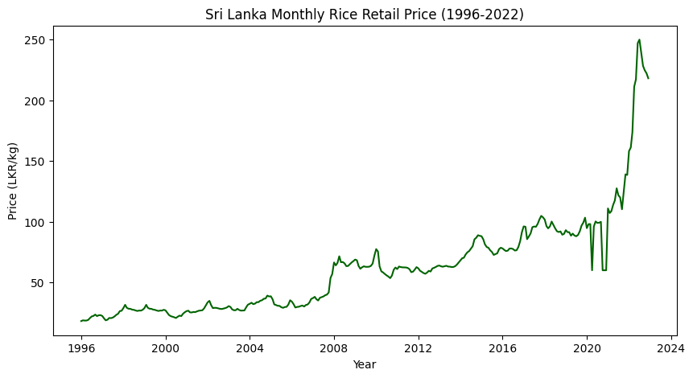
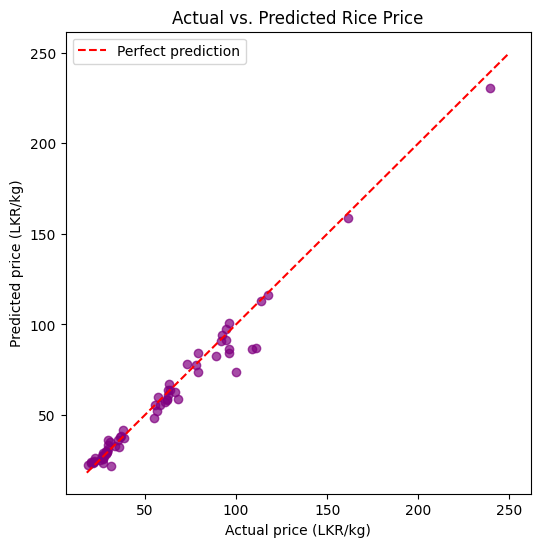

# Rice Price Prediction in Sri Lanka

## Problem Description

Rice is Sri Lanka's staple food, and its retail price has become highly unstable in
recent years — most notably during the 2021–2022 economic crisis, when the price
nearly tripled (from approximately Rs. 95/kg to Rs. 250/kg). Sudden price spikes
disproportionately affect low-income households, making this a direct food-security
concern.



Sample illustration of the retail price trend, showing the sharp spike during the
2021–2022 crisis.

This project builds a simple Python-based solution that predicts the monthly retail
rice price in Sri Lanka using related economic indicators — producer prices,
exchange rate, fuel price, and money supply. The goal is to help consumers, farmers,
and policymakers better anticipate price changes.

## Dataset Source

**SriOryzia: Multivariate Rice Price Forecasting**
By luqmanrumaiz, published on Kaggle:
https://www.kaggle.com/datasets/luqmanrumaiz/srioryzia-multivariate-rice-price-forecasting

- 324 monthly records, January 1996 – December 2022
- Columns: retail price, producer prices (Anuradhapura, Kurunegala, Polonnaruwa),
  exchange rate, fuel price, paddy production, and money supply (M0, M1, M2, M2B)
- File used: `processed/processed_data.csv` from the original Kaggle download,
  included here as `rice_price_data.csv`

## Required Python Libraries

- pandas
- numpy
- matplotlib
- scikit-learn

Install with:
```
pip install pandas numpy matplotlib scikit-learn
```

## Instructions for Running the Program

1. Make sure `rice_price_data.csv` is in the same folder as the notebook
   (or update the file path if using Google Colab with Google Drive).
2. Open `rice_price_prediction.ipynb` in Jupyter Notebook, JupyterLab, or Google Colab.
3. Run all cells in order, from top to bottom.
4. The notebook will:
   - Load and clean the dataset
   - Display summary statistics and visualisations
   - Train a Linear Regression model to predict rice price
   - Print the model's accuracy (R² and MAE) and show an actual-vs-predicted plot

## Sample Output

Below is a sample actual-vs-predicted plot in the style the notebook produces.



## Demo Video

A walkthrough demo of this project is available in this repo:
[`rice_price_prediction_sl_demo.mp4`](rice_price_prediction_sl_demo.mp4)

